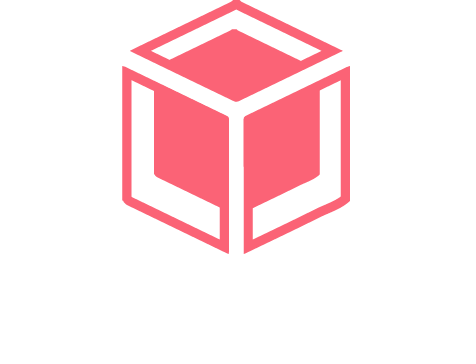
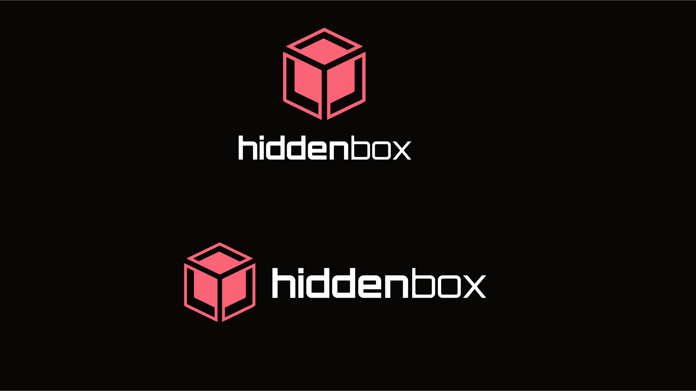
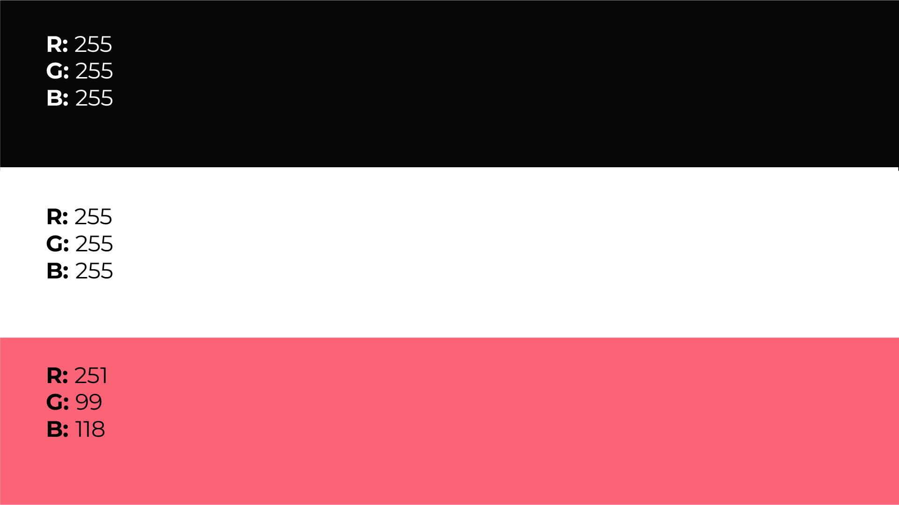
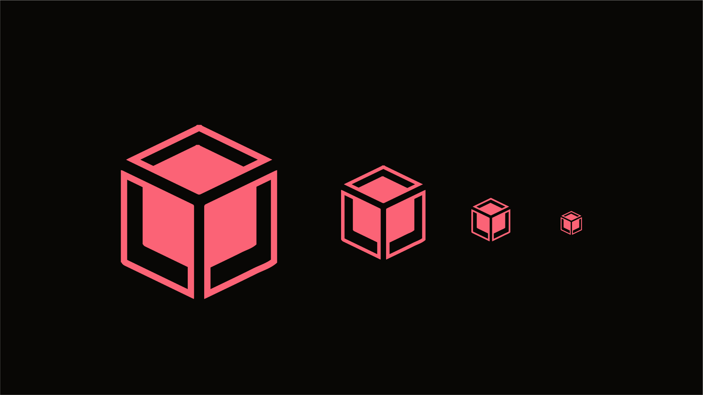

    
      
    <h2>Private and encrypted services in the cloud

HiddenBox is an open-source ecosystem of privacy-centric cloud applications. It includes two main independent services: HiddenBox Storage (a secure distributed file storage system) and HiddenBox Chat (an end-to-end encrypted messaging platform). Both services are built on strong security and decentralization principles, targeting technical users and privacy enthusiasts.

    

        
    

    

        
    

    

        
    

## :closed_lock_with_key: Why hiddenbox?

- **End-to-End Encryption**: All communication and file storage are encrypted client-side using modern cryptographic algorithms.
- **Self-Hosting First**: Full control of your data — deploy on your infrastructure.
- **Modular Architecture**: Use Storage or Chat independently, or integrate them for maximum synergy.
- **Open Source**: Community-driven, GPL/Apache licensed, and transparent.

## :globe_with_meridians: Services

### Hiddenbox storage

HiddenBox Storage is a secure, distributed cloud storage platform. It uses data fragmentation, symmetric encryption, and redundancy to ensure that files remain available and intact even if some storage nodes fail. Key features include:

- **Encryption and Sharding**: Files are encrypted using symmetric cryptography and split into multiple fragments.

- **Distributed Redundancy**: Encrypted fragments are stored across multiple nodes with redundancy for fault tolerance.

- **Infrastructure as Code**: Deployment and configuration are managed with Terraform and Ansible for reproducible, scalable setups.

- **Automated Deployment**: All services run in Docker containers (using Docker Compose) for easy, consistent deployment.

- **Web Interface**: A React-based web UI lets users securely upload, download, and manage their files through a browser.

### Hiddenbox chat

HiddenBox Chat is a modern, end-to-end encrypted messaging platform. It provides secure real-time communication using state-of-the-art web technologies. Key features include:

- **End-to-End Encryption**: Messages and attachments are encrypted on the client side using a hybrid asymmetric-symmetric scheme (e.g. RSA + AES).

- **Real-Time Messaging**: Built with React (frontend) and Laravel (backend), it uses WebSockets (via Laravel Echo) for live chat functionality.

- **Modern Tech Stack**: The application is fully containerized with Docker for easy deployment and scalability.

- **Secure Media Storage**: (Planned) Integration with HiddenBox Storage will allow chat history and media files to be stored securely in the distributed storage system.

- **Privacy-Focused**: No plaintext data is stored on the servers; all communication remains confidential to users.

## Use cases

- **Privacy-conscious individuals** looking for alternatives to Google Drive or Dropbox.
- **Developers** and **Sysadmins** hosting private storage/chat for teams.
- **Open-source communities** who prefer transparency and decentralization.
- **Organizations** handling sensitive information (journalists, activists, researchers).

## Security Model

| Threat                  | Mitigation                                |
|-------------------------|--------------------------------------------|
| Unauthorized Access     | End-to-end encryption (AES + RSA)         |
| Data Breach on Server   | Encrypted fragments + no plaintext stored |
| Node Failure            | Redundancy across distributed nodes       |
| Eavesdropping           | WebSocket encryption + TLS                |

 

 > 🔒 **Security Disclaimer**: *While HiddenBox follows strong security practices, users are responsible for key management and securing their hosting environment*.

## Documentation

Detailed documentation is available in the docs/ directory of each repository. Documentation includes setup guides, architecture details, and usage instructions. Please refer to it for installation, configuration, and deployment information for each service.

## Contributions

Want to contribute? There are multiple ways you can contribute to this project. Here are some ideas:

* [Translate the web into multiple languages!](/docs/CONTRIBUTING.md#translations)
* [Reporting Bugs](/docs/CONTRIBUTING.md#reporting-bugs) 
* [Check out some issues](https://github.com/sporestudio/hiddenbox/issues) (or translate them).

## Community

Want to stay updated or contribute to the conversation?

- **Website** (coming soon)
- **Discord server** (planned)
- **Contact**: *hiddenboxorg@proton.me*

## ❓ FAQ

**Q: Can I use only one of the services?**  
Yes. Storage and Chat are independent modules that can be used separately.

**Q: What happens if I lose my encryption key?**  
Data becomes unrecoverable. You are in control — and responsible — for your keys.

**Q: Is there a public instance I can try?**  
Not yet. HiddenBox is designed for self-hosting (for now), but demo environments may be offered in the future.

## License
This project is under [GNU General Public License](./LICENSE).

---

  Built with ❤️ for privacy, freedom and transparency.

